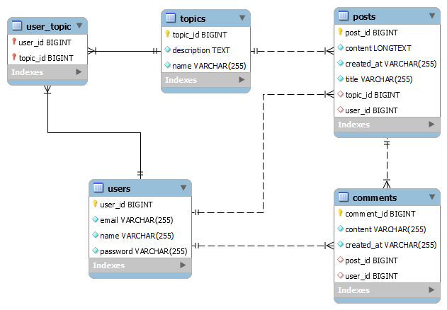
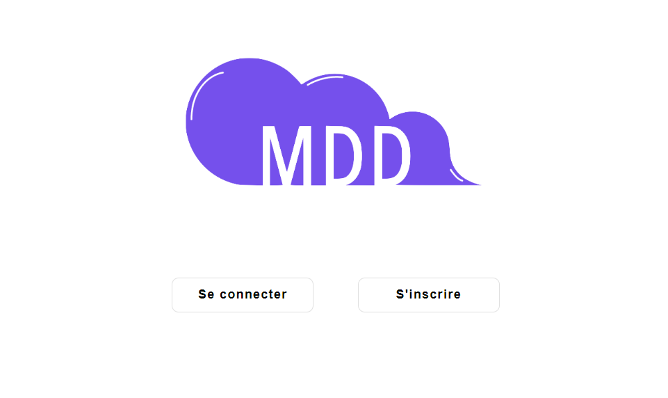

# P6-Monde De Dev

## Set-up locally

### Database
This project uses a MySQL database. 
First create a database named mdd.
Import the script `mdd_sample.sql` located in the resources folder of the project.



### Backend

This is a Spring Boot project with maven.

In `back\src\main\resources\`:
create a file named `env.properties`

Add these properties with your credentials:
```
spring.datasource.username=your username
spring.datasource.password=your password
jwt.secret=your JWT secret key
```
#### Development server
Run: `mvn clean install` then use your IDE to run the application.

The backend will run on http://localhost:9000/

To access openApi go to http://localhost:9000/swagger-ui/index.html#/

### Front

This project uses Angular version 17.

Install node modules:  `npm i`


#### Development server
Run : `npm run start` for a dev server. Navigate to `http://localhost:4200/`. The application will automatically reload if you change any of the source files.

------
### Home page of the application
